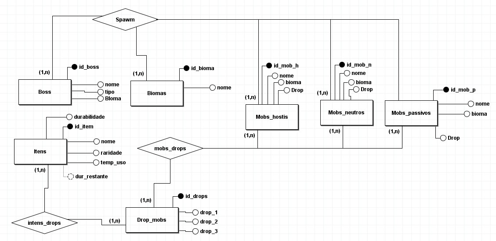
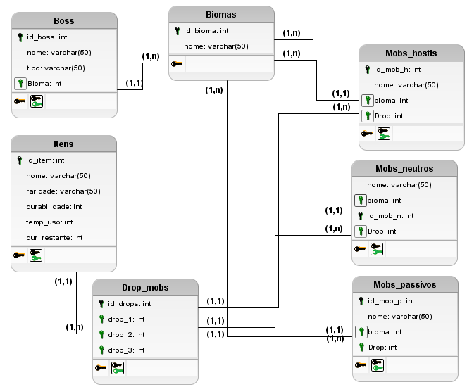
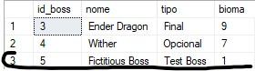
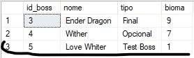
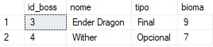

# SQL-Mine-BD

## 1 - Cenário

### Descrição do Cenário

 Em uma vila de um mundo quadrado, Steve tinha acabado de voltar de uma aventura com sua amiga Alex. Eles haviam coletado muitos materiais e encontrado diversas criaturas. Porem no meio dessa aventura eles acabaram perdendo muito tempo procurando itens e criaturas que eles já haviam encontrado de novo por não lembrar mais onde encontrar tais itens. Então eles decidiram criar um sistema de banco de dados para facilitar as próximas aventuras. Nesse sistema eles planejam cadastrar todos os itens e materiais encontrados e todas as criaturas e bosses encontrados, falando sempre o que cada criatura poderia derrubar ao ser abatida.

O que Stive planeja cadastrar será organizado da seguinte forma:

 Itens: contendo um id para cada, nome deles, durabilidade (se tiver), o tempo de uso, o quanto o itens está gasto e a raridade do item

Já os Mobs serão dividos em três categorias sendo elas Mobs Passivos, Mobs Hostis e Mobs Neutros contento os seguintes campos:

 Mobs: contendo um id para cada, o nome deles, o bioma de geração deles e o que esse mob dropa

também será cadastrado Biomas e as combinações de drops de cada mob da seguinte maneira:

 Biomas: contendo um id para cada e o nome do bioma
 Drop dos Mobs: contendo um id para cada combinação de itens que foram dropados e 3 campos para cadastrar até 3 itens que podem ser dropados pelo mob

E por fim será cadastrado também uma tabela para os Boos do jogo de maneira parecida com a dos Mobs:

 Boss: contendo um id para cada, o nome deles, tipo para identificar se é ou não o boss final e em qual bioma se encontra esse bos
 
 ## 2 - Modelagem Conceitual

 

 ## 3 - Modelagem Lógica

 

## 4 - Modelagem Fisica

```sql
CREATE DATABASE Att_final;
USE Att_final;

-- Tabela Itens
CREATE TABLE Itens(
id_item INT PRIMARY KEY IDENTITY,
nome VARCHAR(30),
raridade VARCHAR(20),
durabilidade INT,
gasto INT,
dur_rest AS (durabilidade - gasto)
);

-- Tabela Drop Mobs
CREATE TABLE Drop_mobs(
id_drop INT PRIMARY KEY IDENTITY,
drop_1 INT,
drop_2 INT,
drop_3 INT,

FOREIGN KEY(drop_1) REFERENCES Itens(id_item),
FOREIGN KEY(drop_2) REFERENCES Itens(id_item),
FOREIGN KEY(drop_3) REFERENCES Itens(id_item)
);

-- Tabela Biomas
CREATE TABLE Biomas (
    id_bioma INT IDENTITY PRIMARY KEY,
    nome VARCHAR(30)
);

-- Tabela Boss
CREATE TABLE Boss (
    id_boss INT IDENTITY PRIMARY KEY,
    nome VARCHAR(50),
    tipo VARCHAR(10), -- Indica se é ou não o boss final do jogo
    bioma INT,
    FOREIGN KEY (bioma) REFERENCES Biomas(id_bioma)
);

-- Tabela Mobs_hostis
CREATE TABLE Mobs_hostis (
    id_mob_h INT IDENTITY PRIMARY KEY,
    nome VARCHAR(50),
    bioma INT,
    drops_m INT,
    FOREIGN KEY (bioma) REFERENCES Biomas(id_bioma),
    FOREIGN KEY (drops_m) REFERENCES Drop_mobs(id_drop)
);

-- Tabela Mobs_neutros
CREATE TABLE Mobs_neutros (
    id_mob_n INT IDENTITY(1,1) PRIMARY KEY,
    nome VARCHAR(50),
    bioma INT,
    drops_m INT,
    FOREIGN KEY (bioma) REFERENCES Biomas(id_bioma),
    FOREIGN KEY (drops_m) REFERENCES Drop_mobs(id_drop)
);

-- Tabela Mobs_passivos
CREATE TABLE Mobs_passivos (
    id_mob_p INT IDENTITY(1,1) PRIMARY KEY,
    nome VARCHAR(50),
    bioma INT,
    drops_m INT,
    FOREIGN KEY (bioma) REFERENCES Biomas(id_bioma),
    FOREIGN KEY (drops_m) REFERENCES Drop_mobs(id_drop)
);
```

## 5 - Inserção de Dados

```sql
INSERT INTO Biomas (nome) VALUES
('Planície'),
('Deserto'),
('Floresta'),
('Montanha'),
('Pântano'),
('Savanna'),
('Oceano'),
('Nether'),
('The End'),
('Bambu'),
('Taiga'),
('Campos'),
('Jungle'),
('Mushroom Island'),
('Mesa'),
('Ice Spikes'),
('Deep Dark'),
('Mangrove'),
('Beach'),
('Badlands');

-- Inserir dados na tabela Itens
INSERT INTO Itens (nome, raridade, durabilidade, gasto) VALUES
('Espada de Ferro', 'Comum', 250, 0),
('Arco', 'Comum', 384, 0),
('Pérola do Ender', 'Raro', NULL, NULL),
('Bastão de Blaze', 'Raro', NULL, NULL),
('Osso', 'Comum', NULL, NULL),
('Flecha', 'Comum', NULL, NULL),
('Pólvora', 'Comum', NULL, NULL),
('Barra de Ferro', 'Comum', NULL, NULL),
('Barra de Ouro', 'Comum', NULL, NULL),
('Frango Cru', 'Comum', NULL, NULL),
('Maçã', 'Comum', NULL, NULL),
('Carne de Vaca', 'Comum', NULL, NULL),
('Couro', 'Comum', NULL, NULL),
('Batata', 'Comum', NULL, NULL),
('Cenoura', 'Comum', NULL, NULL),
('Trigo', 'Comum', NULL, NULL);

-- Inserir dados na tabela Drop_mobs
INSERT INTO Drop_mobs (drop_1, drop_2, drop_3) VALUES
(1, 5, 9),    -- Espada de Ferro, Osso, Barra de Ouro
(2, 3, 8),    -- Arco, Pérola do Ender, Barra de Ferro
(6, 7, 10),   -- Flecha, Pólvora, Frango Cru
(4, 8, 9),    -- Bastão de Blaze, Barra de Ouro, Barra de Ferro
(3, NULL, NULL), -- Pérola do Ender
(4, NULL, NULL), -- Bastão de Blaze
(2, 3, 8),    -- Arco, Pérola do Ender, Barra de Ferro
(6, 7, 10),   -- Flecha, Pólvora, Frango Cru
(1, 5, 9),    -- Espada de Ferro, Osso, Barra de Ouro
(2, 3, NULL), -- Arco, Pérola do Ender
(6, 7, 10),   -- Flecha, Pólvora, Frango Cru
(4, 8, 9),    -- Bastão de Blaze, Barra de Ouro, Barra de Ferro
(1, 6, 9),    -- Espada de Ferro, Flecha, Pepita de Ouro
(2, 5, 10),   -- Arco, Osso, Frango Cru
(11, NULL, NULL), -- Maçã
(12, NULL, NULL), -- Carne de Vaca
(13, NULL, NULL), -- Couro
(14, NULL, NULL), -- Batata
(15, NULL, NULL), -- Cenoura
(16, NULL, NULL); -- Trigo

-- Inserir dados na tabela Mobs_hostis
INSERT INTO Mobs_hostis (nome, bioma, drops_m) VALUES
('Zumbi', 1, 1), -- Drops: Espada de Ferro, Osso, Barra de Ouro
('Esqueleto', 2, 2), -- Drops: Arco, Pérola do Ender, Barra de Ferro
('Creeper', 1, 3), -- Drops: Flecha, Pólvora, Frango Cru
('Aranha', 3, 4), -- Drops: Bastão de Blaze, Barra de Ouro, Barra de Ferro
('Enderman', 9, 5), -- Drops: Pérola do Ender
('Blaze', 8, 6), -- Drops: Bastão de Blaze
('Ghast', 8, 7), -- Drops: Arco, Pérola do Ender, Barra de Ferro
('Slime', 5, 8), -- Drops: Flecha, Pólvora, Frango Cru
('Pillager', 6, 9), -- Drops: Espada de Ferro, Osso, Barra de Ouro
('Evoker', 6, 10), -- Drops: Pérola do Ender
('Witch', 7, 11), -- Drops: Flecha, Pólvora, Frango Cru
('Drowned', 1, 12), -- Drops: Bastão de Blaze, Barra de Ouro, Barra de Ferro
('Vindicator', 3, 13), -- Drops: Espada de Ferro, Flecha, Pepita de Ouro
('Phantom', 4, 14), -- Drops: Arco, Osso, Frango Cru
('Husk', 2, 15), -- Drops: Maçã
('Stray', 2, 16), -- Drops: Carne de Vaca
('Wither Skeleton', 8, 17), -- Drops: Couro
('Magma Cube', 8, 18), -- Drops: Batata
('Piglin Brute', 8, 19), -- Drops: Cenoura
('Zombie Pigman', 8, 20); -- Drops: Trigo

-- Inserir dados na tabela Mobs_neutros
INSERT INTO Mobs_neutros (nome, bioma, drops_m) VALUES
('Lobo', 1, 1), -- Drops: Espada de Ferro, Osso
('Endermite', 2, 2), -- Drops: Arco
('Iron Golem', 3, 3), -- Drops: Pérola do Ender
('Snow Golem', 4, 4), -- Drops: Bastão de Blaze
('Piglin', 8, 5), -- Drops: Espada de Ferro, Osso, Barra de Ouro
('Dolphin', 7, 6), -- Drops: Arco, Pérola do Ender, Barra de Ferro
('Bee', 5, 7), -- Drops: Flecha, Pólvora, Frango Cru
('Trader Llama', 6, 8), -- Drops: Bastão de Blaze, Barra de Ouro, Barra de Ferro
('Panda', 10, 9), -- Drops: Espada de Ferro, Flecha, Pepita de Ouro
('Polar Bear', 4, 10), -- Drops: Arco, Osso, Frango Cru
('Pig', 11, 11), -- Drops: Maçã
('Cow', 12, 12), -- Drops: Carne de Vaca
('Sheep', 13, 13), -- Drops: Couro
('Chicken', 14, 14), -- Drops: Batata
('Horse', 15, 15), -- Drops: Cenoura
('Donkey', 16, 16), -- Drops: Trigo
('Mule', 17, 1), -- Drops: Espada de Ferro, Osso
('Cat', 18, 2), -- Drops: Arco
('Ocelot', 19, 3), -- Drops: Pérola do Ender
('Fox', 20, 4); -- Drops: Bastão de Blaze

-- Inserir dados na tabela Mobs_passivos
INSERT INTO Mobs_passivos (nome, bioma, drops_m) VALUES
('Vaca', 1, 11), -- Drops: Maçã
('Porco', 2, 12), -- Drops: Carne de Vaca
('Ovelha', 3, 13), -- Drops: Couro
('Galinha', 4, 14), -- Drops: Batata
('Cavalo', 5, 15), -- Drops: Cenoura
('Burro', 6, 16), -- Drops: Trigo
('Coelho', 7, 1), -- Drops: Espada de Ferro, Osso
('Papagaio', 8, 2), -- Drops: Arco
('Morcego', 9, 3), -- Drops: Pérola do Ender
('Peixe', 7, 11), -- Drops: Maçã
('Tartaruga', 1, 12), -- Drops: Carne de Vaca
('Golfinho', 2, 13), -- Drops: Couro
('Panda', 3, 14), -- Drops: Batata
('Raposa', 4, 15), -- Drops: Cenoura
('Abelha', 5, 16), -- Drops: Trigo
('Cavalo Marinho', 6, 1), -- Drops: Espada de Ferro, Osso
('Polvo', 7, 2), -- Drops: Arco
('Avestruz', 8, 3), -- Drops: Pérola do Ender
('Kiwi', 9, 4); -- Drops: Bastão de Blaze

INSERT INTO Boss (nome, tipo, bioma) VALUES
('Ender Dragon', 'Final', 9),  -- Bioma: The End
('Wither', 'Opcional', 7);     -- Bioma: Nether
```

## 6 - CRUD
### 1 - Inserção e Leitura de Dados
Abaixo Temos um exemplo de uma inserção de dados na tablea Biomas
```sql
INSERT INTO Biomas (nome) VALUES
('Planície'),
('Deserto'),
('Floresta'),
('Montanha'),
('Pântano'),
('Savanna'),
('Oceano'),
('Nether'),
('The End'),
('Bambu'),
('Taiga'),
('Campos'),
('Jungle'),
('Mushroom Island'),
('Mesa'),
('Ice Spikes'),
('Deep Dark'),
('Mangrove'),
('Beach'),
('Badlands');
```

Agora um exemplo de leitura desses dados recem inseridos
```sql
SELECT * FROM Biomas;
```
Um print do que foi mostrado


### 2 - Alteração e Deleção de Dados
Agora iremos adicionar um boss ficticio para poder dar um exemplo de como deletar um valor e alterar um valor
```sql
INSERT INTO Boss (nome, tipo, bioma) VALUES
('Fictitious Boss', 'Test Boss', 1);
```
O valor inserido na tabela



Agora iremos alterar esse valor
```sql
UPDATE Boss
SET nome = 'Love Whiter'
WHERE nome = 'Fictitious Boss';
```
Como ficou na tabela



Por último iremos deletar esse campo agora usando o seguinte código
```sql
DELETE FROM Boss
WHERE nome = 'Love Whiter';
```
Como a tabela ficou depois de deletar


