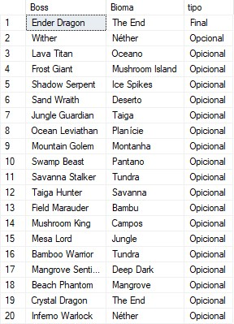

# SQL-Mine-BD

## 1 - Cenário

### Descrição do Cenário

 Em uma vila de um mundo quadrado um pouco diferente de como conhecemos, Estive tinha acabado de voltar de uma aventura com sua amiga Alexana. Eles haviam coletado muitos materiais e encontrado diversas criaturas. Porem no meio dessa aventura eles acabaram perdendo muito tempo procurando itens e criaturas, que eles já haviam encontrado, de novo por não lembrar mais onde encontrar tais itens e criaturas. Então eles decidiram criar um sistema de banco de dados para facilitar as próximas aventuras. Nesse sistema eles planejam cadastrar todos os itens e materiais encontrados e todas as criaturas e bosses encontrados, falando sempre o que cada criatura poderia derrubar ao ser abatida.

O que Estive planeja cadastrar será organizado da seguinte forma:

 Itens: contendo um id para cada, nome deles, durabilidade (se tiver), o tempo de uso, o quanto o itens está gasto e a raridade do item.

Já os Mobs serão dividos em três categorias sendo elas Mobs Passivos, Mobs Hostis e Mobs Neutros contento os seguintes campos:

 Mobs: contendo um id para cada, o nome deles, o bioma de geração deles e o que esse mob dropa.

também será cadastrado Biomas e as combinações de drops de cada mob da seguinte maneira:

 Biomas: contendo um id para cada e o nome do bioma
 Drop dos Mobs: contendo um id para cada combinação de itens que foram dropados e 3 campos para cadastrar até 3 itens que podem ser dropados pelo mob.

E por fim será cadastrado também uma tabela para os Boos do jogo de maneira parecida com a dos Mobs:

 Boss: contendo um id para cada, o nome deles, tipo para identificar se é ou não o boss final e em qual bioma se encontra esse bos.

Agora depois de planejar o que deveria fazer, Estive começara a fazer o seu projeto.
 
 ## 2 - Modelagem Conceitual

 

 ## 3 - Modelagem Lógica

 

## 4 - Modelagem Fisica

```sql
CREATE DATABASE Att_final;
USE Att_final;

-- Tabela Itens
CREATE TABLE Itens(
id_item INT PRIMARY KEY IDENTITY,
nome VARCHAR(30),
raridade VARCHAR(20),
durabilidade INT,
gasto INT,
dur_rest AS (durabilidade - gasto)
);

-- Tabela Drop Mobs
CREATE TABLE Drop_mobs(
id_drop INT PRIMARY KEY IDENTITY,
drop_1 INT,
drop_2 INT,
drop_3 INT,

FOREIGN KEY(drop_1) REFERENCES Itens(id_item),
FOREIGN KEY(drop_2) REFERENCES Itens(id_item),
FOREIGN KEY(drop_3) REFERENCES Itens(id_item)
);

-- Tabela Biomas
CREATE TABLE Biomas (
    id_bioma INT IDENTITY PRIMARY KEY,
    nome VARCHAR(30)
);

-- Tabela Boss
CREATE TABLE Boss (
    id_boss INT IDENTITY PRIMARY KEY,
    nome VARCHAR(50),
    tipo VARCHAR(10), -- Indica se é ou não o boss final do jogo
    bioma INT,
    FOREIGN KEY (bioma) REFERENCES Biomas(id_bioma)
);

-- Tabela Mobs_hostis
CREATE TABLE Mobs_hostis (
    id_mob_h INT IDENTITY PRIMARY KEY,
    nome VARCHAR(50),
    bioma INT,
    drops_m INT,
    FOREIGN KEY (bioma) REFERENCES Biomas(id_bioma),
    FOREIGN KEY (drops_m) REFERENCES Drop_mobs(id_drop)
);

-- Tabela Mobs_neutros
CREATE TABLE Mobs_neutros (
    id_mob_n INT IDENTITY(1,1) PRIMARY KEY,
    nome VARCHAR(50),
    bioma INT,
    drops_m INT,
    FOREIGN KEY (bioma) REFERENCES Biomas(id_bioma),
    FOREIGN KEY (drops_m) REFERENCES Drop_mobs(id_drop)
);

-- Tabela Mobs_passivos
CREATE TABLE Mobs_passivos (
    id_mob_p INT IDENTITY(1,1) PRIMARY KEY,
    nome VARCHAR(50),
    bioma INT,
    drops_m INT,
    FOREIGN KEY (bioma) REFERENCES Biomas(id_bioma),
    FOREIGN KEY (drops_m) REFERENCES Drop_mobs(id_drop)
);
```

## 5 - Inserção de Dados

```sql
-- Inserir dados na tabela Biomas
INSERT INTO Biomas (nome) VALUES
('Planície'),
('Deserto'),
('Floresta'),
('Montanha'),
('Pântano'),
('Savanna'),
('Oceano'),
('Nether'),
('The End'),
('Bambu'),
('Taiga'),
('Campos'),
('Jungle'),
('Mushroom Island'),
('Mesa'),
('Ice Spikes'),
('Deep Dark'),
('Mangrove'),
('Beach'),
('Badlands');

-- Inserir dados na tabela Itens
INSERT INTO Itens (nome, raridade, durabilidade, gasto) VALUES
('Espada de Ferro', 'Comum', 250, 0),
('Arco', 'Comum', 384, 0),
('Pérola do Ender', 'Raro', NULL, NULL),
('Bastão de Blaze', 'Raro', NULL, NULL),
('Osso', 'Comum', NULL, NULL),
('Flecha', 'Comum', NULL, NULL),
('Pólvora', 'Comum', NULL, NULL),
('Barra de Ferro', 'Comum', NULL, NULL),
('Barra de Ouro', 'Comum', NULL, NULL),
('Frango Cru', 'Comum', NULL, NULL),
('Maçã', 'Comum', NULL, NULL),
('Carne de Vaca', 'Comum', NULL, NULL),
('Couro', 'Comum', NULL, NULL),
('Batata', 'Comum', NULL, NULL),
('Cenoura', 'Comum', NULL, NULL),
('Trigo', 'Comum', NULL, NULL),
('Diamond', 'Rare', 1561, 0),
('Emerald', 'Rare', 0, 0),
('Potion of Healing', 'Uncommon', 0, 0),
('Netherite Ingot', 'Epic', 2031, 0);

-- Inserir dados na tabela Drop_mobs
INSERT INTO Drop_mobs (drop_1, drop_2, drop_3) VALUES
(1, 5, 9),    
(2, 3, 8),    
(6, 7, 10),   
(4, 8, 9),    
(3, NULL, NULL), 
(4, NULL, NULL), 
(2, 3, 8),    
(6, 7, 10),   
(1, 5, 9),    
(2, 3, NULL), 
(6, 7, 10),   
(4, 8, 9),    
(1, 6, 9),    
(2, 5, 10),   
(11, NULL, NULL), 
(12, NULL, NULL), 
(13, NULL, NULL), 
(14, NULL, NULL), 
(15, NULL, NULL), 
(16, NULL, NULL); 

-- Inserir dados na tabela Mobs_hostis
INSERT INTO Mobs_hostis (nome, bioma, drops_m) VALUES
('Zumbi', 1, 1), 
('Esqueleto', 2, 2), 
('Creeper', 1, 3), 
('Aranha', 3, 4), 
('Enderman', 9, 5), 
('Blaze', 8, 6), 
('Ghast', 8, 7), 
('Slime', 5, 8), 
('Pillager', 6, 9), 
('Evoker', 6, 10), 
('Witch', 7, 11), 
('Drowned', 1, 12), 
('Vindicator', 3, 13),
('Phantom', 4, 14), 
('Husk', 2, 15), 
('Stray', 2, 16), 
('Wither Skeleton', 8, 17), 
('Magma Cube', 8, 18), 
('Piglin Brute', 8, 19), 
('Zombie Pigman', 8, 20); 

-- Inserir dados na tabela Mobs_neutros
INSERT INTO Mobs_neutros (nome, bioma, drops_m) VALUES
('Lobo', 1, 1), 
('Endermite', 2, 2), 
('Iron Golem', 3, 3), 
('Snow Golem', 4, 4), 
('Piglin', 8, 5), 
('Dolphin', 7, 6), 
('Bee', 5, 7), 
('Trader Llama', 6, 8), 
('Panda', 10, 9), 
('Polar Bear', 4, 10), 
('Pig', 11, 11), 
('Cow', 12, 12), 
('Sheep', 13, 13),
('Chicken', 14, 14),
('Horse', 15, 15), 
('Donkey', 16, 16),
('Mule', 17, 1), 
('Cat', 18, 2), 
('Ocelot', 19, 3),
('Fox', 20, 4); 

-- Inserir dados na tabela Mobs_passivos
INSERT INTO Mobs_passivos (nome, bioma, drops_m) VALUES
('Vaca', 1, 11),
('Porco', 2, 12),
('Ovelha', 3, 13),
('Galinha', 4, 14),
('Cavalo', 5, 15), 
('Burro', 6, 16), 
('Coelho', 7, 1), 
('Papagaio', 8, 2),
('Morcego', 9, 3), 
('Peixe', 7, 11), 
('Tartaruga', 1, 12),
('Golfinho', 2, 13), 
('Panda', 3, 14), 
('Raposa', 4, 15), 
('Abelha', 5, 16), 
('Cavalo Marinho', 6, 1), 
('Polvo', 7, 2), 
('Avestruz', 8, 3),
('Kiwi', 9, 4),
('Vaca Cogumelo', 2, 10);

INSERT INTO Boss (nome, tipo, bioma) VALUES
('Ender Dragon', 'Final', 9),  
('Wither', 'Opcional', 7),     
('Lava Titan', 'Opicional', 7),
('Frost Giant', 'Opicional', 16),
('Shadow Serpent', 'Opicional', 17),
('Sand Wraith', 'Opicional', 2),
('Jungle Guardian', 'Opicional', 13),
('Ocean Leviathan', 'Opicional', 6),
('Mountain Golem', 'Opicional', 4),
('Swamp Beast', 'Opicional', 5),
('Savanna Stalker', 'Opicional', 10),
('Taiga Hunter', 'Opicional', 11),
('Field Marauder', 'Opicional', 12),
('Mushroom King', 'Opicional', 14),
('Mesa Lord', 'Opicional', 15),
('Bamboo Warrior', 'Opicional', 10),
('Mangrove Sentinel', 'Opicional', 18),
('Beach Phantom', 'Opicional', 19),
('Crystal Dragon', 'Opicional', 9),
('Inferno Warlock', 'Opicional', 8);
```

## 6 - CRUD
### 1 - Inserção e Leitura de Dados
Abaixo Temos um exemplo de uma inserção de dados na tablea Biomas:
```sql
INSERT INTO Biomas (nome) VALUES
('Planície'),
('Deserto'),
('Floresta'),
('Montanha'),
('Pântano'),
('Savanna'),
('Oceano'),
('Nether'),
('The End'),
('Bambu'),
('Taiga'),
('Campos'),
('Jungle'),
('Mushroom Island'),
('Mesa'),
('Ice Spikes'),
('Deep Dark'),
('Mangrove'),
('Beach'),
('Badlands');
```

Agora um exemplo de leitura desses dados recem inseridos:
```sql
SELECT * FROM Biomas;
```
Um print do que foi mostrado:


### 2 - Alteração e Deleção de Dados
Agora iremos adicionar um boss ficticio para poder dar um exemplo de como deletar um valor e alterar um valor:
```sql
INSERT INTO Boss (nome, tipo, bioma) VALUES
('Fictitious Boss', 'Test Boss', 1);
```
O valor inserido na tabela:


Agora iremos alterar esse valor:
```sql
UPDATE Boss
SET nome = 'Love Whiter'
WHERE nome = 'Fictitious Boss';
```
Como ficou na tabela:


Por último iremos deletar esse campo agora usando o seguinte código:
```sql
DELETE FROM Boss
WHERE nome = 'Love Whiter';
```
Como a tabela ficou depois de deletar


## 7 - Relatórios
Agora para testar o banco, razlizaremos 10 relatórios/consulta.
### Consulta 1: Seleciona todos os biomas e ordenar por nome
```sql
SELECT * FROM Biomas
ORDER BY nome;
```
O que foi mostrado:


### Consulta 2: Seleciona todos os itens e suas durabilidades restantes, ordenando pela raridade
```sql
SELECT nome, raridade, dur_rest FROM Itens
ORDER BY raridade;
```
O que foi mostrado:


###  Consulta 3: Seleciona todos os mobs hostis e os biomas em que eles aparecem
```sql
SELECT Mobs_hostis.nome AS Mob, Biomas.nome AS Bioma FROM Mobs_hostis
JOIN Biomas ON Mobs_hostis.bioma = Biomas.id_bioma
ORDER BY Mobs_hostis.nome;
```
O que foi mostrado:


### Consulta 4: Seleciona todos os mobs neutros que aparecem na 'Floresta'
```sql
SELECT Mobs_neutros.nome AS Mob FROM Mobs_neutros
JOIN Biomas ON Mobs_neutros.bioma = Biomas.id_bioma
WHERE Biomas.nome = 'Floresta';
```
O que foi mostrado:


### Consulta 5: Seleciona todos os mobs passivos e os itens que eles dropam
```sql
SELECT Mobs_passivos.nome AS Mob, Itens.nome AS Item FROM Mobs_passivos
JOIN Drop_mobs ON Mobs_passivos.drops_m = Drop_mobs.id_drop
JOIN Itens ON Drop_mobs.drop_1 = Itens.id_item
ORDER BY Mobs_passivos.nome;
```
O que foi mostrado:


### Consulta 6: Seleciona todos os bosses e os biomas em que eles aparecem, ordenando por tipo
```sql
SELECT Boss.nome AS Boss, Biomas.nome AS Bioma, Boss.tipo FROM Boss
JOIN Biomas ON Boss.bioma = Biomas.id_bioma
ORDER BY Boss.tipo;
```
O que foi mostrado:



### Consulta 7: Seleciona todos os mobs hostis que dropam 'Espada de Ferro'
```sql
SELECT Mobs_hostis.nome AS Mob FROM Mobs_hostis
JOIN Drop_mobs ON Mobs_hostis.drops_m = Drop_mobs.id_drop
JOIN Itens ON Drop_mobs.drop_1 = Itens.id_item OR Drop_mobs.drop_2 = Itens.id_item OR Drop_mobs.drop_3 = Itens.id_item
WHERE Itens.nome = 'Espada de Ferro';
```
O que foi mostrado:


### Consulta 8: Conta quantos mobs passivos existem em cada bioma, ordenando pelo número de mobs
```sql
SELECT Biomas.nome AS Bioma, COUNT(Mobs_passivos.id_mob_p) AS Num_Mobs FROM Mobs_passivos
JOIN Biomas ON Mobs_passivos.bioma = Biomas.id_bioma
GROUP BY Biomas.nome
ORDER BY Num_Mobs DESC;
```
O que foi mostrado:


### Consulta 9: Seleciona todos os itens que são raros e ordenar pelo nome
```sql
WHERE raridade = 'Raro'
ORDER BY nome;
```
O que foi mostrado:


###  Consulta 10: Selecionar todos os mobs neutros e hostis que aparecem no mesmo bioma, mostrando o bioma e os nomes dos mobs
```sql
SELECT Biomas.nome AS Bioma, Mobs_neutros.nome AS Neutro, Mobs_hostis.nome AS Hostil FROM Mobs_neutros
JOIN Biomas ON Mobs_neutros.bioma = Biomas.id_bioma
JOIN Mobs_hostis ON Mobs_hostis.bioma = Biomas.id_bioma
ORDER BY Biomas.nome, Mobs_neutros.nome, Mobs_hostis.nome;
```
O que foi mostrado:


